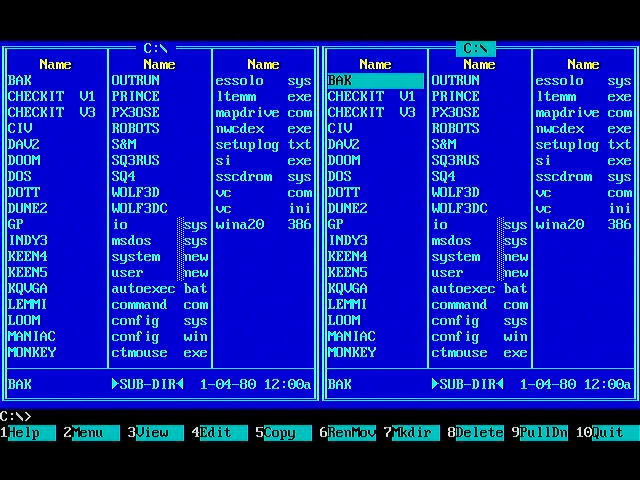

# FRANK 386 on FRANK Core 2 — moving work to the second RP2350

Plan for a `BOARD=C2` build of FRANK 386 that runs on the dual-RP2350
FRANK Core 2 / Core 2U board, using the inter-processor link already
proven in `murmgenesis` (`docs/C2_SOUND_SPLIT.md`).

**M1, M2, PC and Z2 must be unaffected.** Everything here sits behind a
compile-time seam; on the single-chip boards the code paths compile to
exactly what they do today.

---

## 1. Where the time actually goes today

This matters more than the hardware, because the obvious split — "put
the emulator on one chip and the peripherals on the other" — is not the
one that pays.

`main.c` runs the emulator like this:

| Core | Work |
|---|---|
| **Core 0** | `pc_step()` — i386 interpreter, VGA memory writes, PIT/CMOS/8042/8257×2/FDC ticks, `poll_keyboard()` (**including `tuh_task()`**), blocking `f_read`/`f_lseek` from IDE and FDD, **and OPL2 synthesis** |
| **Core 1** | VGA/HDMI scanline generation ISR, the 44.1 kHz audio mixer ISR, `i2s_dma_write()` |

Two findings from reading the code change the shape of the plan:

**`vga_refresh()` is a no-op on RP2350.** `src/vga.c:1172` short-circuits
under `RP2350_BUILD`; video is generated on the fly from `gfx_buffer`
(`drivers/vga/vga_hw.c:105`, 256 KB in master SRAM) by the scanout path
on core 1. There is no software framebuffer conversion to move. Guest
*writes* into VGA memory (`vga_mem_write*`, planar write modes, bit
masks, ROPs) stay on core 0 by necessity — `gfx_buffer` is the scanout
source.

**Core 1 is already saturated by real-time scanout, which is why sound
leaked back onto core 0.** `src/pc.c:781` interleaves `adlib_core0()`
into the interpreter every *ten* instructions:

```c
if (pc->adlib_enabled) {
    for (int i = 0; i < 409; ++i) {
        cpui386_step(pc->cpu, 10);
        adlib_core0(pc->adlib);
    }
} else {
    cpui386_step(pc->cpu, 4096);
}
```

That is the tell. The whole 44.1 kHz OPL2 stream (`emu8950`) is produced
on core 0, in 10-instruction slices, because core 1 has no room for it.
The cost is not only emu8950's own cycles — it is 409 extra loop
entries/exits per `pc_step()`, wrecking the interpreter's inner-loop
locality and its branch history.

**The structural problem is therefore: the master has no free core.**
Core 1 is a video timing engine. Everything that should live on a second
core has been pushed back onto core 0, where it competes with the
interpreter for both cycles and QMI/PSRAM bandwidth.

The slave RP2350 is a genuinely free dual-core CPU with its own 8 MB
PSRAM and 16 MB flash. That is the resource to spend.

---

## 2. What the board allows

From `frank_core2/firmware/common/frank_core2_board.h` (extracted from
the KiCad netlist; `frank_core2u_board.h` is byte-identical apart from
names, so one plan covers both revisions):

| Peripheral | Side | Pins |
|---|---|---|
| HDMI (J5), **via HSTX** | master | GPIO12–19 |
| microSD (J7), SPI0 | master | GPIO4–7 |
| TDA1387T I2S DAC (U8) | master | GPIO9–11 |
| USB-C host/device (J8) | master | — |
| 8 MB PSRAM (U2) | master | CS GPIO47 |
| 8 MB PSRAM (U5) | **slave** | CS GPIO0 |
| 16 MB flash (U4) | **slave** | — |
| USB-C (J9), UART (J4), LED | slave | — |

So SD, HDMI, the DAC and USB host are all physically on the master and
cannot move. What *can* move is compute that only needs an event stream.

There is no PS/2 on this board — input is USB HID. There is no analog
VGA.

**Core 2's HDMI, microSD and I2S pins are identical to M2's.** HDMI on
GPIO12–19, SD on GPIO4–7, I2S on GPIO9–11 — the same numbers in the same
order. The existing PIO DVI encoder in `drivers/hdmi/hdmi.c` therefore
works unchanged, and bring-up needed no new video driver at all. *(This
corrects the original draft, which assumed HSTX was mandatory; see §4.)*

Two hardware constraints to design around:

- **GPIO43 ("RUNA/SR") is not connected to the slave's RUN pin** — it
  only reaches a 10K pull-up. The master cannot reset the slave in
  hardware; both halves are flashed and reset independently. The only
  soft recovery is pulsing FS, which the slave samples from its serve
  loop.
- **Both halves must be built at the same `CPU_SPEED`.** The receiving
  PIO program must finish its loop inside the transmitter's byte period,
  and each side derives that from its own `clk_sys`. Mismatched clocks
  give a link that works one way and drops bytes the other. This cost
  `murmgenesis` a day of debugging.

### The link

Two independent 8-bit source-synchronous PIO buses, one per direction,
each with its own clock and VALID strobe, plus three SIO control wires
(FS, DB_MS, DB_SM). Measured **96.1 MiB/s aggregate, error-free** on the
first assembled board; `murmgenesis` budgets against **48 MB/s per
direction**. Rate is `sys_clk / 5` bytes/s, so it scales with the clock.

On the master the link needs an instance it can set to
`pio_set_gpio_base(16)` — bus B lands on GPIO30–39 — and that setting is
per-instance, so the instance cannot be shared with anything below
GPIO16.

**The link goes on PIO0.** *(Corrected during phase 0: `murmgenesis`
uses PIO2, but murm386's I2S driver hardcodes `pio2`
(`drivers/audio/audio.c:48`), and HDMI holds PIO1 with two SMs on
GPIO12–19. PIO0 is free only because C2 has no PS/2 driver to claim
it — on M1/M2 it carries the PS/2 keyboard and mouse.)* The allocation
is recorded in `src/board_config.h` under `BOARD_C2` so it cannot drift.

| Instance | Owner on C2 | Pins |
|---|---|---|
| PIO0 | **link TX + RX**, `gpio_base = 16` | 20–29, 30–39 |
| PIO1 | HDMI (2 SMs) | 12–19 |
| PIO2 | I2S DAC | 9–11 |

---

## 3. Proposed allocation

```
MASTER  RP2350B                      SLAVE  RP2350A
─────────────────────────            ─────────────────────────
core 0  i386 interpreter             core 0  sound subsystem
        VGA memory writes                    OPL2 (emu8950)
        device ticks -> core 1               SB16 DSP + mixer
                                             SN76489 (Tandy)
core 1  HSTX scanout (hardware)              MPU-401 wavetable
        I2S DMA feed                         DSS, PC speaker
        USB host (tuh_task)                  -> 44.1 kHz stereo
        keyboard/mouse polling
        link exchange                core 1  disk block cache
                                             (8 MB PSRAM)
        PSRAM: guest RAM                     PSRAM: cached blocks
        SRAM:  gfx_buffer 256 KB
```

The goal is stated as a single sentence: **core 0 of the master runs the
i386 interpreter and nothing else.**

### 3.1 Sound → slave (highest confidence, direct port of the proven work)

Move OPL2, SB16, SN76489, the MPU-401 wavetable, DSS and the PC speaker
sample generator to the slave. This is structurally identical to what
`murmgenesis` already ships and debugged on this exact board.

**Master → slave:** every I/O port write that reaches a sound device
becomes an 8-byte timestamped event, appended to a lock-free ring by
core 0 and shipped once per frame by core 1. The call sites are already
localised — `pc_io_write`/`pc_io_read` in `src/pc.c` (lines 248–333 and
527–633) is the complete list, and a `sound_backend_*` seam over those
compiles to identical code on M1/M2/PC/Z2.

**Slave → master:** one mixed stereo 44.1 kHz buffer per frame (735
frames × 2 ch × 2 B ≈ 2.9 KB), consumed by the existing
`repeat_me_often()` / `i2s_dma_write()` path.

Two reverse dependencies need care — the same class of problem
`murmgenesis` solved with a master-side shadow:

- **`adlib_read()`** returns OPL timer-1/timer-2 overflow flags plus the
  busy bit. Those follow from writes to registers 0x02–0x04 and elapsed
  time; no FM synthesis is involved. Model it on the master from the
  writes it is already forwarding. No round trip.
- **`sb16_dsp_read()` / `sb16_mixer_read()`** return DSP status,
  read-data and DMA-ack state. Keep the **i8257 DMA engine on the
  master** — it is a memcpy out of guest RAM and it must stay next to
  guest RAM anyway. The master therefore already knows the DMA position
  and can answer status locally; it ships the fetched PCM to the slave
  as a bulk block. At worst 44.1 kHz × 2 ch × 16 bit = **176 KB/s**.

**Reset the accumulated cycle counters at frame start.** `murmgenesis`
lost time twice to exactly this (`zclk` and `ym.clock`), each time
producing constant DC that read as a mixing fault. Whatever carries the
timestamp base here needs the same discipline.

**Link budget:** events ~16 KB/frame worst case + audio 2.9 KB + SB16
PCM 3 KB ≈ **22 KB/frame ≈ 1.3 MB/s ≈ 2.7% of one direction.** The wire
is nowhere near the constraint.

**What this buys:** `adlib_core0()` leaves the interpreter loop, so
`pc_step()` returns to a single `cpui386_step(pc->cpu, 4096)`. The
44.1 kHz mixer ISR leaves core 1. That freed core-1 capacity is what
makes §3.2 possible.

### 3.2 USB host and input → master core 1 (free, no link work)

`tuh_task()` currently runs on core 0 via `poll_keyboard()` →
`usbkbd_tick()` → `hid_app.c:371`, every 20 iterations of the main loop.
TinyUSB's host task is not cheap and it runs partly from flash.

USB is wired to the master, so it cannot cross the link — but once §3.1
and §4 free core 1, it simply moves there, along with all keyboard and
mouse polling and the per-`pc_step` device ticks that do not need to be
in the CPU loop (`cmos_update_irq`, `fdc_tick`, the two `i8257_dma_run`
calls). Interrupt delivery stays where it is; only the polling moves.

This costs nothing but a queue and is worth doing regardless of whether
the rest of the plan proceeds.

*Core 2U note:* that revision adds an MW7211A USB hub (U10/U12) and a
TS3USB221 2:1 USB mux (U14). If the mux can steer a host port to the
slave's PHY, USB HID could move to the slave outright. **This needs
confirming against a netlist export before anyone plans around it** — I
read the schematic sheets but did not trace the nets.

### 3.3 Disk block cache in slave PSRAM (largest user-visible win)

The slave's 8 MB PSRAM is otherwise idle. SD stays on the master, but
every `f_read`/`f_lseek` in `src/ide.c` (lines 583, 848, 893, 1465,
1616) and `src/fdd.c` (394, 434, 722) is a **blocking stall on core 0**
in the middle of emulation. Under Windows 95, which swaps constantly,
this dominates perceived speed far more than instruction throughput
does.

Insert a block cache below the FatFS calls:

- Cache 4 KB blocks keyed by (image id, block index); ~2000 blocks in
  7 MB of slave PSRAM, direct-mapped with a small master-side tag array
  so a miss costs no link traffic at all.
- Hit: one bulk read, 4 KB at 48 MB/s ≈ **85 µs** plus ~15 µs of control
  round trip.
- Miss: read from SD as today, then push the block to the slave on the
  way past.
- Writes: write-through to SD, invalidate or update the cached copy. Do
  **not** write back lazily — an SD card can be pulled and the emulator
  can be reset by the settings UI at any time.

Against a FatFS seek + 4 KB SPI read this should be roughly an order of
magnitude faster on hits. Small random 512 B reads gain proportionally
less, which is why the block size should be 4 KB or larger.

This is the one item with no analogue in `murmgenesis`, so it carries
the most implementation risk — but it is also self-contained and can be
built and measured independently of the sound split.

### 3.4 Explicitly *not* moving

- **The i386 interpreter.** It reaches guest RAM as a flat pointer into
  XIP-mapped PSRAM at `0x11000000` (`src/pc.c:978`). Any split would put
  a link round trip inside the memory access path. Non-starter.
- **The x87 FPU** (`src/fpu.c`). Synchronous per instruction; a round
  trip per FPU op would be far slower than softfloat locally.
- **Guest RAM in slave PSRAM.** ~100 ns local versus ~3 µs over the
  link. Use that PSRAM for the disk cache instead.
- **VGA memory / `gfx_buffer`.** It is the live scanout source on the
  master and is read by the guest as well as written.

### 3.5 Stretch: conventional memory in master SRAM

Not a link change, but enabled by one. Moving sound off frees a
meaningful slice of the master's 520 KB SRAM (emu8950 tables, SB16 and
MIDI buffers). The low ~640 KB of guest RAM is where DOS spends nearly
all of its time, and RP2350's XIP cache is only 8 KB, so most guest
accesses are PSRAM round trips today.

Backing the low region with SRAM would need a branch in every guest
memory access, which may cost more than it saves. **Prototype and
measure before committing** — but if it works it is potentially a larger
win than everything above.

---

## 4. Phase 0 — C2 board support  *(done, not yet hardware-tested)*

`src/board_config.h` knew only M1, M2, PC and Z2. `BOARD=C2` now builds
a master-half image, `c2p2-386-<clk>MHz-P<psram>-I2S-<ver>.uf2`:

```bash
./build.sh -C2 -378
```

What it took:

1. **`boards/frank_core2_master.h`** (from `murmgenesis`), selected via
   `PICO_BOARD_HEADER_DIRS`. Required, not cosmetic: the stock `pico2`
   definition sets `PICO_RP2350A 1`, which caps `NUM_BANK0_GPIOS` at 30
   and disables PIO's movable GPIO window — the link bus (GPIO20–42),
   the WS2812 (GPIO46) and PSRAM CS (GPIO47) would all silently alias
   down into 0–29. It also declares the correct 16 MB flash.
2. **`BOARD_C2` section in `board_config.h`**, transcribed from
   `frank_core2_board.h`, including the link pins and the PIO
   allocation so neither can drift.
3. **`BOARD_HAS_PS2` capability flag.** C2 call sites are guarded on the
   capability, not on the board name, so a future PS/2-less board does
   not mean revisiting `main.c` again.
4. **C2 forces `FORCE_HDMI`, `AUDIO_TYPE=I2S` and `USB_HID_ENABLED`** in
   CMake — none of the three is optional on this hardware.
5. **Console on UART0** (J2, GPIO0/1, 115200). The existing USB-HID path
   disabled *both* USB and UART stdio, which would have left C2 with no
   console at all — on a board whose slave the master cannot reset, that
   is not a state to bring up blind.

**HSTX was not required and is deferred.** The original draft assumed
Core 2 needed the HSTX driver ported; in fact its HDMI pins are
identical to M2's, so the existing PIO DVI encoder works as-is. HSTX
remains worth doing *as an optimisation* — it generates TMDS in hardware
and would free core 1 from pixel generation — but it is now an
independent item, not a prerequisite, and it should be justified by the
phase-0 profile like anything else.

### Verified on hardware

Flashed to the master (U3) over SWD at 378 MHz / PSRAM 133 MHz. Boot log
on UART0 (J2) plus live target reads:

| Check | Result |
|---|---|
| Board identification | `Board: C2 (FRANK Core 2 master)` |
| Flash | W25Q128 detected, **16384 KiB** — board header correct |
| PSRAM | CS GPIO47, **8 MB test passed** |
| Video | init on base pin GPIO12; `SELECT_VGA = 0`, so HDMI |
| I2S | GPIO9 / 10 / 11 |
| microSD | **mounted**, `386/` found, `config.ini` loaded |
| Emulator | `initialized = 1`, `pc = 0x2006fdf8`, core 0 executing `i386.c:peek8` |

And then it booted DOS from the SD card and ran Volkov Commander:



So phase 0 is complete: the master half runs the emulator on Core 2
hardware, end to end.

### Video: VGA is available too

`FORCE_VGA` (`./build.sh -C2 --vga`) drives VGA timing out of GPIO12–19
instead of HDMI. It takes precedence over `FORCE_HDMI` in
`vga_hw_init()`, so a board whose block defaults to HDMI can still be
built for VGA without unpicking it.

Useful side effect for debugging: the VGA path never calls
`hdmi_boost_clock()`, so `clk_sys` stays at the configured speed — which
also removes the console truncation described below.

### The console truncation was a clock race — resolved on VGA

`console_reclock()` (`src/main.c`) recomputes the UART divisors after
every clock change; without it the console died one line into the boot,
at `Configuring overclock`.

That fixed everything except a truncation at `Reconfiguring clocks:`.
The cause was a race, not a baud error: core 1 runs
`hdmi_boost_clock()` — changing `clk_sys` to 504 MHz — while core 0 is
mid-`printf`. On the VGA build the console now survives all the way to
`Starting emulation...`.

It will still truncate on an HDMI build at 504 MHz. Worth fixing
properly before phase 1, since the link bring-up gets debugged through
this console.

For anyone chasing it: `clk_peri` is `pll_usb` (48 MHz,
`CLK_PERI_CTRL = 0x10000840`, AUXSRC 2), *not* `clk_sys`.

### Bench setup

- Debug Probe `E6616407E335BB29` → master (U3) SWD **and** UART console.
- Debug Probe `4150335932333507` → slave (U6) SWD.
- `USB Video` (640x480, 30 fps) capture on the video output.

`./flash.sh --swd-id` maps probes to halves automatically by reading
`SYSINFO.PACKAGE_SEL` (bit 0: 1 = RP2350A slave, 0 = RP2350B master), so
neither half can be flashed with the other's image.

Capture a frame with:

```bash
ffmpeg -f avfoundation -framerate 30 -video_size 640x480 \
       -i "1" -frames:v 1 -update 1 shot.png
```

**Read target memory without halting.** OpenOCD `mdw`/`mdb` work fine on
a running RP2350 through the AHB-AP. Halting it clears CPACR, and the
core then faults on the next `gpio_put` or 64-bit timestamp; doing that
repeatedly left the master unreachable over SWD (`cannot read IDR`,
`nRESET = 0`) and needed a power cycle to recover.

### Known issue: console dies after the clock reconfiguration

`uart_init()` computes the baud divisors once, from whatever `clk_peri`
is at the time, and nothing recomputes them afterwards. The console
turned to line noise at exactly `Configuring overclock: 378 MHz` — one
line into the boot, on the board's only debug surface.

`console_reclock()` (`src/main.c`) now calls `uart_set_baudrate()` after
every clock change — in `configure_clocks()`, `reconfigure_clocks()` and
`hdmi_boost_clock()`. That recovered the whole early boot.

Output still stops mid-line at `Reconfiguring clocks:`, and everything
after it is lost even though the firmware demonstrably completes init.
The likely cause is a race rather than a baud error: core 1 runs
`hdmi_boost_clock()` — which changes `clk_sys` to 504 MHz — while core 0
is mid-`printf`. A truncated line at a clock change is exactly that
shape. Worth fixing before phase 1, because the link bring-up will be
debugged through this console.

Note for anyone chasing it: `clk_peri` is `pll_usb` (48 MHz,
`CLK_PERI_CTRL = 0x10000840`, AUXSRC 2), *not* `clk_sys`. Live divisors
read IBRD 26 / FBRD 3 = 115200, i.e. correct — so the loss is not a
steady-state baud mismatch.

### Still unverified

- HDMI picture on a real display.
- USB HID host enumeration on J8, and whether the Core 2U hub/mux
  changes it.
- The TDA1387 I2S DAC actually producing sound.
- Booting a guest OS to a DOS prompt.
- 504 MHz / PSRAM 166 MHz.

### Regression check

M1, M2, PC and Z2 were rebuilt and compared against `main`. All symbol
sizes and loadable sections are byte-identical. The only code delta is
in `show_welcome_screen`, where hoisting a declaration out of the plasma
loop moved one `strd` ahead of a call — same instructions, same size.

Two things worth knowing for any future comparison:

- **`BOARD=PC` did not build on `main`** with the default `--debug`:
  `main.c` printed `I2S_DATA_PIN` unconditionally and the Olimex board
  defines no I2S pins. Fixed here; the print now follows the audio type.
- **No two murm386 builds are ever byte-identical.** `misc.c:161` seeds
  the emulated CMOS clock from `__TIME__`, so `cmos_update_time` always
  differs. Compare symbol sizes and disassembly, not `cmp` on the `.bin`.

Next: get this running on real hardware with the slave idle, and **take
a profile there**. That baseline is what every later number is measured
against.

---

## 5. Repository layout

Mirror `murmgenesis`, which keeps one tree building both halves:

```
murm386/
  src/            shared: sound devices built into both halves
  link/           vendored from murmgenesis/link/ —
                  link_bus.{c,h,pio}, link_proto.{c,h},
                  link_session.{c,h}, link_pins.h
  slave/
    CMakeLists.txt        -> frank-386-slave
    src/main.c            serve loop
    src/slave_sound.c     the sound subsystem
    src/slave_cache.c     the disk block cache
  boards/
    frank_core2_master.h
    frank_core2_slave.h
  build.sh        BOARD=C2 builds BOTH halves at one CPU_SPEED
  flash.sh        --slave targets the slave SWD header (J3)
```

`link_bus`, `link_session` and the PIO programs port over **unchanged**.
`link_proto.h` needs a new opcode set — the transport is generic, the
protocol is not.

Vendor rather than submodule: the two projects will diverge on protocol,
and a shared submodule would couple their release cadence for no gain.

**Prefer SWD over USB BOOTSEL for the slave.** `picotool reboot -u`
cannot recover a target that has faulted into lockup, which is exactly
the state you will be in while bringing this up. J1 is the master's
header, J3 the slave's.

---

## 6. Phases

Each phase is independently useful and independently measurable.

| # | Phase | Depends on | Expected effect |
|---|---|---|---|
| 0 | `BOARD=C2` builds ✅ / boots on hardware ✅ / baseline profile ✅ | — | none — bring-up |
| 1 | Port the link layer; master and slave exchange a ping | 0 | none — infrastructure |
| 2 | `sound_backend_*` seam, still calling the chips locally | 0 | **none anywhere**, on any board. Verify byte-identical behaviour on M1/M2 before going further |
| 3 | Slave firmware: event replay, mixer, audio return | 1, 2 | `adlib_core0()` leaves the CPU loop; core 1's mixer ISR goes away |
| ~~4~~ | ~~Move `tuh_task` + input polling to core 1~~ | — | **dropped** — measured at 0.1%, see §6a |
| 5 | Disk block cache in slave PSRAM | 1 | removes blocking SD stalls — the largest Win95 win |
| 6 | Reset / disk-change / settings forwarding; slave-absent recovery | 3, 5 | robustness |
| 7 | *(stretch)* conventional memory in master SRAM | 3 | unknown; measure first |
| — | *(optional)* HSTX HDMI instead of PIO DVI | 0 | frees core 1 from pixel generation and PIO1 |

A note on master SRAM: the C2 image already sits at **87.5% of 512 KB**
(458,600 B), against 88.3% for M2. The link's event ring and control
buffers have to come out of what phase 3 frees by moving emu8950's
tables, the SB16 buffers and the MIDI wavetable to the slave — so size
the ring *after* that removal, not before, and keep an eye on the
number at every phase.

Phase 2 is the safety gate for the other four boards. It should produce
identical generated code on M1/M2/PC/Z2 — check the disassembly, not
just that it still boots.

---

## 6a. The baseline profile — measured, and it changes the plan

`./build.sh -C2 --vga --subsys-profile` enables coarse per-subsystem
cycle accounting on core 0 (`src/profile_subsys.{c,h}`), using the
Cortex-M33 DWT cycle counter and reporting every 2000 `pc_step()` calls.
Disk time is captured at the `disk_read`/`disk_write` choke point in
`drivers/sdcard/sdcard.c`, so every image access is counted in one
place.

Measured on hardware at a DOS prompt under Volkov Commander, 504 MHz
(the SD `config.ini` raises the clock from the built-in 378):

```
--- core0 profile: 2000 steps, 1285 ms wall, 504 MHz ---
  cpu        92.0%   (i386 interpreter)
    of which disk   0.0%  (223 SD ops)
  adlib       5.0%   (OPL2 on core 0)
  devices     0.0%   (PIT/CMOS/8042/DMA/FDC/vga_step)
  poll        0.1%   (USB host + input)
  refresh     0.0%   (vga_refresh)
  other       2.5%
```

A second window agreed: cpu 88.6%, adlib 7.2%, everything else ≤0.1%.

### What this confirms

- **The interpreter is ~90% of core 0**, and it does not move. No split
  makes i386 emulation itself faster.
- **`vga_refresh` really is free** on RP2350 (0.0%), as the source
  reading suggested. Nothing to reclaim there.
- **AdLib costs 5–7% at an idle DOS prompt**, with no music playing.
  `adlib_core0()` renders silence at full price. That is the single
  largest movable item on core 0, and it is a permanent tax rather than
  a load-dependent one — a better argument for offloading it than the
  original plan made.

### What this refutes

- **Phase 4 is not worth doing.** `poll` — TinyUSB's `tuh_task()` plus
  all input polling — is **0.1%**. The plan asserted this was "a real
  steal from the interpreter's core". It is not. Moving it to core 1
  buys nothing measurable; drop it unless a profile under heavy USB
  traffic says otherwise.
- **The per-`pc_step` device ticks are 0.0–0.1%**, not the meaningful
  overhead implied in §1. PIT, CMOS, 8042, both DMA controllers, the
  FDC and `vga_step` together cost less than the profiler's noise.

### What is still unmeasured

**Disk shows 0.0% at an idle prompt** across 223 SD operations, which
says nothing about phase 5. The disk cache was argued as "the largest
user-visible win", and that claim is still entirely unmeasured — it
needs a disk-thrashing workload (Windows 95 booting or swapping) before
anyone builds it. Driving that needs keyboard input to the guest.

### Revised priorities

| Item | Measured value | Verdict |
|---|---|---|
| Phase 3 — sound to slave | 5–7% of core 0, always on | **Do it.** Largest confirmed win, and it also collapses the 409-iteration interleave |
| Phase 5 — disk cache | unknown, 0% at idle | **Measure first** under a disk-heavy load |
| Phase 7 — conventional memory in SRAM | untested | **Now the most interesting.** 90% is the interpreter and it is PSRAM-bound |
| Phase 4 — USB/input to core 1 | 0.1% | **Drop** |

The honest summary: moving the sound subsystem to the slave is worth
about 5–7% of core 0 plus whatever the loop restructuring returns from
the 2.5% "other". That is a real gain and worth having, but it is not
the dramatic speed-up the second processor first appeared to promise.
The dramatic win, if there is one, is in the interpreter's memory path —
phase 7 — which is not a link problem at all.

## 6b. Slave memory as a fast tier — the idea I got wrong

§3.4 dismissed putting guest RAM on the slave: *"~100 ns local versus
~3 µs over the link."* Both halves of that comparison were wrong, and
the conclusion with them.

### The local side is far slower than claimed

`prof_mem_bench()` measures the real path — the cached XIP window that
`pload8()` uses — at 504 MHz:

| Access | Cycles | Time |
|---|---|---|
| PSRAM random (8 MB span, defeats the 8 KB XIP cache) | **184** | **365 ns** |
| PSRAM sequential, 64 B stride | 149 | 296 ns |
| SRAM random (16 KB span) | **8** | 16 ns |

Guest memory is not "~100 ns". It is **365 ns, 184 core cycles**, and
PSRAM is **23× slower than SRAM**. Since the interpreter is ~90% of core
0 (§6a) and reaches guest memory through this path constantly, these
stalls are where the machine's time actually goes.

### The link side was quoted for the wrong protocol

The ~3 µs figure is a `link_session` control-frame round trip — a
doorbell handshake plus a 128-byte DMA'd frame, built for throughput.
A latency-optimised path is a different thing entirely: both PIO state
machines kept armed, push a 4-byte address, spin on the RX FIFO, no DMA
and no doorbell.

Rough budget at 504 MHz, one byte per 5 clocks:

| Step | Cycles |
|---|---|
| 4-byte address out | 20 |
| slave notices FIFO, reads SRAM, pushes reply | 20–40 |
| 4-byte data back | 20 |
| PIO pipeline both ways | 10–20 |
| **Total** | **~70–100** |

If that holds, **slave SRAM over the link is roughly twice as fast as
the master's own PSRAM**, not twenty times slower.

### Why this fits the constraint better than master SRAM

Phase 7 wanted the hot low megabyte in master SRAM, but there is no room:
the C2 image already uses 87% of 512 KB, `gfx_buffer` alone is 256 KB,
and moving sound to the slave frees only tens of KB. The slave has
~400 KB of *idle* SRAM and a second core to serve it.

And the dispatch is already free. `load8()` (`src/i386.c:670`) reads:

```c
if (unlikely(addr >= cpu->phys_mem_size)) {
    return 0;
}
return pload8(cpu, addr);
```

Every access is *already* range-checked, and the branch is already
predicted not-taken. Serving a remote region costs local accesses
nothing — the hook is turning that `return 0` into a link fetch.

### Measured on hardware: 89 cycles

Built and run. `link/link_fast.{c,h}` is the latency path, `slave/` is a
memory server, and the round trip was measured with the DWT counter over
1024 exchanges at 504 MHz:

| Tier | Cycles | Time | vs PSRAM |
|---|---|---|---|
| Master SRAM (local) | 7 | 14 ns | 26× faster |
| **Slave SRAM over the link** | **89** | **177 ns** | **2.0× faster** |
| Master PSRAM random | 182 | 361 ns | — |

4096 verification reads came back with **zero** errors, so this is a
working memory tier and not just a latency figure.

**The second chip's SRAM is twice as fast as the master's own guest
RAM.** The estimate above was right, and §3.4's dismissal was wrong on
both sides of the comparison.

Writes are better still: `linkf_write32()` is posted — two FIFO writes
and no round trip at all — where PSRAM writes go through the QMI.

### The PIO allocation, corrected twice

Getting here took two wrong answers about which PIO the link can use,
both of which presented as "the slave is dead":

1. The link went on **PIO0**, which the plan called free "because C2 has
   no PS/2". True for an HDMI build, where video is on PIO1 — but
   `vga_hw.h:38` defines `VGA_PIO` as **pio0**, so on a VGA build the
   video path owns it and drives GPIO12–19, below the base-16 window the
   link needs.
2. Moving to PIO1 then failed because `sdcard.c:66` hardcodes **pio1**
   for its SPI program, and `SDCARD_PIO` was defined for every board.

Both failures were silent. `pio_set_gpio_base()` returns
`PICO_ERROR_INVALID_STATE` when the instance already has a program
loaded, and the original code ignored it, so the symptom was a link that
initialised cleanly and never answered.

The fix: `SDCARD_PIO` is no longer defined on C2. Nothing is lost — the
C2 microSD is on GPIO4–7, exactly the hardware SPI0 pins. That gives:

| Instance | HDMI build | VGA build |
|---|---|---|
| PIO0 | **link** | VGA |
| PIO1 | HDMI (2 SMs) | **link** |
| PIO2 | I2S DAC | I2S DAC |

`LINK_PIO_MASTER` follows `FORCE_VGA` in `board_config.h`, and
`linkf_init()` now returns false rather than failing quietly.

### One more trap: always-armed receivers drift

Both RX state machines stay armed so a request can be a single FIFO
write. The cost is that they are also armed while the *peer's* PIO has
not yet taken its pins, so the floating bus clocks stray bits into the
input shift register and autopush lands on the wrong 32-bit boundary —
permanently, and invisibly.

`linkf_sync()` fixes it with a one-time handshake on the VALID lines
(plain SIO, no PIO timing): each side raises its own once its PIO owns
the pins, waits for the peer's, then restarts its receiver. After that
both transmitters park their clocks low until a word is pushed, so
nothing can drift again.

### Wired into the interpreter

`src/remote_mem.{c,h}`, enabled with `./build.sh -C2 --vga --remote-mem`.

**The dispatch lives in `pload*`/`pstore*`, not `load*`/`store*`.** The
latter would have been free — they already range-check — but two paths
reach memory without them: page-table walks and instruction prefetch,
both of which call `pload32()` directly. A window that quietly
mishandled page tables or code fetches would fail in ways that look
nothing like a memory bug, so the cheaper mistake is one
predicted-not-taken compare in `pload8()`.

Sub-word access is a read-modify-write, since the slave serves 32-bit
words. A byte store is therefore two round trips against PSRAM's one —
the single case where remote is worse, and the argument for a
byte-granular opcode if stores ever dominate.

Verified on hardware:

| Check | Result |
|---|---|
| Round trip | 88–89 cycles |
| Self-test, 256 KB through the real accessors | **0 mismatches** |
| Byte-lane test (1024 individual byte writes/reads) | **0 mismatches** |
| `remote_span` | `0x40000` — window open |
| Emulator | boots and runs with the tier live |

### What is *not* yet demonstrated

**No speed-up, because nothing uses the window yet.** It sits immediately
above the 8 MB of local RAM, and DOS never goes there. Right now the
feature can only cost time, not save it.

An A/B of interpreter throughput was attempted and was **invalid** — in
two independent ways, both worth recording because either one alone
would have produced a confident wrong answer.

**1. `build.sh` leaked options through the CMake cache.** It only ever
passed `-DREMOTE_MEM=ON` when the flag was given, and never `=OFF`, so a
plain `./build.sh -C2 --vga` after a `--remote-mem` build silently kept
the cached `ON`. The "control" build was not a control: `CMakeCache.txt`
showed `REMOTE_MEM:BOOL=ON` and `SUBSYS_PROFILE:BOOL=ON` in both arms.
Fixed — every optional feature is now passed explicitly as `ON` or
`OFF`. Any measurement taken before this fix should be discarded.

**2. The guest workload was not controlled.** CheckIt's benchmark was
running during one arm and not the other, which is enough to move the
figure on its own.

**And the instrumented build is genuinely slower.** `SUBSYS_PROFILE`
puts two DWT reads inside the 409-iteration AdLib loop — 818 extra reads
per `pc_step()`, in the hottest loop in the program. It was reported as
a user-visible slowdown in CheckIt, which is exactly right.

So: **`SUBSYS_PROFILE` is for relative breakdown only. Never quote an
absolute performance number from a build that has it enabled, and never
leave it on in a build someone is using.**

A valid A/B needs a clean build in both arms, explicit flags, and a
fixed guest workload driven identically each time. CheckIt's Dhrystone
figure is a good candidate for the workload.

### 6c. The interpreter is compute-bound. This overturns §6b.

A clock-scaling test settles what limits the interpreter. PSRAM's
divider tracks `clk_sys` to stay under its 133 MHz ceiling, so it ran at
~126 MHz in both arms — the CPU clock is the only variable.

| CPU clock | Throughput | Ratio |
|---|---|---|
| 252 MHz | 0.949 MIPS | — |
| 504 MHz | 1.856 MIPS | **1.96× for 2.0× clock** |

**98% linear scaling with the CPU clock, at constant memory speed.** If
PSRAM latency were the limit, doubling the core clock would have bought
almost nothing. The interpreter is **compute-bound**.

#### Why §6b was wrong

The 182-cycle PSRAM figure is real, but it is a *deliberately
cache-defeating* random walk across 8 MB. Real guest workloads have
locality: they largely hit the 8 KB XIP cache and PSRAM's own row
buffer, so the average guest access costs far less than the worst case I
measured and then reasoned from.

At 504 MHz, 1.856 MIPS is **273 core cycles per guest instruction**. That
is not memory stalls — it is interpretation: decode, dispatch, effective
address computation, lazy-flag bookkeeping.

**Consequence: the remote memory tier cannot deliver a meaningful
speed-up, no matter where it is placed.** Serving guest RAM from the
slave at 89 cycles instead of 182 optimises something that is not the
bottleneck. The code stays — it works, it is measured, and it would
matter on a memory-bound workload — but it is not the lever.

#### What the second chip can and cannot do

It cannot make a single x86 instruction stream faster. The stream is
sequential; two cores cannot execute it twice as fast, and moving the
interpreter to the slave changes nothing on its own — same core, same
PSRAM, same 273 cycles per instruction.

What is left for the second chip, honestly ranked:

| Approach | Expected | Effort |
|---|---|---|
| **JIT: slave compiles x86→ARM, master executes** | multiple × — the only path to "dramatic" | very large |
| Sound offload (§3.1) | 5–7% measured | medium |
| Remote memory tier | ~0% on this workload | done, shelved |
| USB/input offload | 0.1% measured | dropped |

Only the first is dramatic, and it is dramatic because it attacks cycles
per instruction rather than moving work sideways. The second chip is
genuinely useful there: compilation is the expensive, parallelisable
half, and it can run on the slave's two cores while the master executes
translated blocks. The hard constraint is where translated code lives —
the master has ~54 KB of SRAM free, and executing JIT output from PSRAM
would reintroduce the fetch cost the JIT exists to remove.

### 6d. JIT feasibility: the guest code working set

`./build.sh -C2 --vga --code-profile` hooks `prefetch_fill()` — which
the interpreter calls once per 16-byte block of guest code it needs — and
records distinct 64-byte blocks in a bitmap. That is a direct
observation of code *executed*, not code resident.

First measurement, idle DOS prompt under Volkov Commander:

| Metric | Value |
|---|---|
| Cumulative distinct code since boot | 1999 blocks = **125 KB** |
| Working set per sampling window | 91 blocks = **5.7 KB** |
| Code above 4 MB | 0 |
| JIT cache for the window at 5× expansion | **28 KB** |

The cumulative figure covers BIOS POST, DOS init and VC startup, so it is
an upper bound for a cache that never evicts: 125 KB × 5 ≈ 625 KB of ARM
code. The window figure is the one a real cache has to hold.

**Caveat: this is an idle prompt, and an idle loop is exactly the case
that flatters a code-cache measurement.** A working set of 5.7 KB is a
keyboard poll, not a workload. The number needed for a real decision is
the working set under something demanding — a game, or CheckIt's
benchmark. Do not size a JIT from the idle figure.

#### Peak working set, and the cost of the split

A high-water mark across every window since boot, plus counters for the
two things that would become link round trips if the interpreter moved
to the slave:

| Metric | Value |
|---|---|
| **Peak window code working set** | 1163 blocks = **72.7 KB** |
| → JIT cache at 5× expansion | **363 KB** |
| Cumulative code since boot | 125 KB |
| VGA writes / reads, 4.3 s idle window | **0 / 0** |
| Port writes | 78 (~18/s) |
| Throughput | 1.897 MIPS |

Two things follow.

**The code cache only fits on the slave.** 363 KB against ~54 KB free on
the master and ~450 KB free on the slave. That is not a preference, it is
the deciding constraint.

**Text-mode DOS costs almost nothing to split.** Zero VGA accesses and
~18 port operations per second means the link would carry a negligible
amount of traffic in this workload.

#### Under Wolf3D — the workload that decides it

Measured live during gameplay, ~6 s windows:

| Metric | Rate | Link cost at 504 MHz |
|---|---|---|
| VGA writes | **254,000/s** | ~1% of the core (**posted**, no round trip) |
| VGA reads | 660/s | negligible (89 cycles each) |
| Port writes | 3,200/s | negligible (posted) |
| Port reads | 1,650/s | 0.03% |
| Throughput | 1.3–1.5 MIPS | (vs 1.9 idle) |

**The split is affordable.** The number that looked frightening —
a quarter of a million VGA writes per second — costs about 1% of the
core, because writes are *posted*: `linkf_write32()` pushes two words
into the TX FIFO and returns. At 8 bytes per write that is 2 MB/s
against a 48 MB/s link, so the FIFO never backs up. Only reads pay the
89-cycle round trip, and there are almost none.

**But the code cache no longer fits comfortably:**

| Metric | Wolf3D |
|---|---|
| Peak window code working set | **109 KB** |
| → JIT cache at 5× expansion | **545 KB** |
| Cumulative code this session | 287 KB |

545 KB against the slave's ~450 KB of free SRAM. **Marginal — it does
not fit at 5×.** Three things could close the gap, and at least one is
needed:

- Better code density. 5× is a pessimistic guess for a template JIT
  with no register allocation; 3–4× is achievable and would fit.
- Eviction. A cache need not hold the whole working set, only the hot
  part, spilling cold blocks to the slave's PSRAM.
- A shorter measurement window. Six seconds overestimates what a cache
  must hold at any instant; the true instantaneous working set is
  smaller.

The honest read: **feasible, but the code cache is the tight resource,
not the link.** That is the opposite of what I expected going in, and it
means codegen density — not bandwidth — is the thing to design around.

*(Caveat: the port-read counter reads 0, which is implausible for a
machine polling the keyboard and PIT. Treat `ioR` as unverified until
the read path is confirmed — the write counter and the VGA counters are
hooked at points that were checked.)*

#### Why this points at the slave, not the master

Translated ARM code has to be *executed*, so it has to sit where
instruction fetch is cheap — SRAM at 7 cycles. Fetching it over the link
(89 cycles) or from PSRAM would reintroduce the cost the JIT exists to
remove.

That makes free SRAM the binding constraint, and the two chips are very
unequal:

| | Free SRAM | Code cache it could hold |
|---|---|---|
| Master | ~54 KB (38 KB in a profiling build) | ~11 KB of guest code at 5× |
| **Slave** | **~450 KB** | **~90 KB of guest code at 5×** |

This is the concrete argument for running the interpreter on the second
chip — not that its core is faster (it is identical), but that it has
**eight times the free SRAM for a code cache**. On the master a JIT would
thrash a 54 KB cache; on the slave, 450 KB comfortably holds the entire
125 KB cumulative footprint measured above, translated.

The corollary is that the master becomes the I/O processor: video, SD,
USB and audio, serving port I/O and VGA memory to the slave over the
link. That is a large re-architecture, and the VGA write path is the part
to cost carefully — in graphics modes those writes are frequent, and each
one becomes an 89-cycle round trip instead of a 7-cycle SRAM store.

### 6e. Inside the interpreter — profile and two failed optimisations

#### Measurement infrastructure

Four tools, all off by default:

| Flag | What it does |
|---|---|
| `--autotype '<keys>'` | Types a script into the guest after boot. `\r` is Enter, `~` a 3-second pause. Makes a workload repeatable without a human. |
| `--pc-sample` | 10 kHz SysTick PC sampler on core 0 (`src/pcsample.c`). |
| `--code-profile` | Guest code working set via `prefetch_fill()`. |
| `--subsys-profile` | Coarse per-subsystem cycles. **Distorts; never quote absolute numbers from it.** |

`g_mips` / `g_mips_avg` are always compiled and nearly free — they read
`cpu->cycle`, the interpreter's own retired-instruction counter.

**An idle DOS prompt is not a benchmark.** It sits in HLT, so 83% of PC
samples landed outside the interpreter and the throughput figure mostly
measured how fast the emulator idles. Driving Wolf3D's attract demo (a
recorded playback, so it repeats) is what made the numbers mean
anything. Estimating instructions as `steps × 4096` was wrong for the
same reason — a halted `pc_step()` returns without running its budget,
which made an idle prompt look like 9 MIPS.

#### Where the 273 cycles per instruction go

861k samples, Wolf3D, 95.7% inside the interpreter:

| Site | Share |
|---|---|
| `peek8` (instruction fetch) | **21.0%** |
| `refresh_flags` → `get_CF` | **12.4%** |
| `cpu_exec1` loop head | 11.3% |
| `fetch16` | 5.2% |
| `translate` / `translate8r` | 5.3% |
| `prefetch_fill` | 2.5% |

**Instruction fetch is ~29% of everything.** The dispatch itself is
already good — computed-goto (`I386_OPT2`) and unaligned word loads
(`I386_OPT1`) are both on.

#### Optimisation 1: `refresh_flags` fast path — no gain, reverted

`refresh_flags` calls six out-of-line getters; when a `cc.mask` bit is
clear the getter just returns the bit already in `cpu->flags`. Guarding
each on its mask bit is provably equivalent and strictly less work.

Measured: baseline 1.816 / 1.800 / 1.773 MIPS, guarded 1.805 / 1.787 /
1.774. **No measurable difference** — `cc.mask` is evidently almost never
clear at these call sites, so the guard never fires and the extra
branches pay for themselves at best. Reverted.

#### Optimisation 2: AdLib disabled — +12%, but confounded

Disabling AdLib gave 2.015 vs 1.796 MIPS, **+12.2%** — more than the
5–7% the subsystem profile attributed to it, consistent with also
removing the 409-iteration interleave and restoring a single
`cpui386_step(cpu, 4096)` call.

**Do not take 12% as the sound offload's value.** With AdLib disabled
the emulator stops answering OPL detection, so Wolf3D may skip its music
player entirely and the *guest* does less work too — which offloading
would not recover, since the guest still runs its music code either way.
The true figure is somewhere between the 5–7% direct cost and 12%, and
pinning it down needs a guest whose behaviour does not change when the
chip disappears.

### 6f. JIT stage 1 — basic-block structure (measured)

`--bb-profile` (`src/bbprofile.{c,h}`) detects block starts in
`cpu_exec1`'s loop head and counts reuse. Wolf3D demo, ~3 minutes:

| Metric | Value |
|---|---|
| Block entries observed | 41,463,388 |
| **Top-64 blocks / tracked entries** | **94.7%** |
| Collisions | 171,415 (0.4%) |
| Live slots | 2028 / 2048 — table saturated |
| **Average block length** | **≈8 instructions** |

Two conclusions, and both are what a code cache needs:

**Blocks are long enough to be worth compiling.** At ~8 instructions per
block, a cache amortises the 29% spent in instruction fetch and the ~11%
in dispatch across eight instructions instead of paying both per
instruction.

**Execution is extremely concentrated.** 64 blocks cover 94.7% of
tracked entries. Even allowing that the 2048-slot table saturated and
undercounts the tail, a cache holding a few thousand blocks would catch
essentially all execution. That is a far smaller cache than the 109 KB
working-set figure implied, because the working set includes cold code
executed once.

#### A budget correction that matters

`cpu_exec1` is **119 KB of interpreter body living in RAM**, second only
to `gfx_buffer`'s 256 KB. Once a JIT covers hot code the interpreter
becomes the cold path and can move back to XIP flash, freeing that
119 KB. With the ~54 KB already free that is **~173 KB of code cache on
the master** — which changes §6d's conclusion: the cache does not
necessarily have to live on the slave.

(Learned the hard way: a 32 KB block table pushed `.bss` to 93.6% and
left `pc_new()` unable to allocate. The build reached `vga_initialized`
and then hung. Master SRAM is genuinely the scarce resource.)

#### Why the cache cannot simply be bolted on

`cpu_exec1` fuses decode and execute into one 119 KB computed-goto
block. A *predecoded* cache — the cheap kind, storing handler pointers
and pre-decoded operands — would mean separating decode from execute
throughout, which is a rewrite of the interpreter rather than an
addition to it.

Native codegen is also large but is **additive**: a compiler and an
executor alongside the interpreter, with the interpreter kept as the
fallback for any opcode not yet handled. That is the safer shape, and
the one to build:

1. Block cache and dispatcher; every block falls back to the
   interpreter. No speed-up, proves entry/exit.
2. Codegen for the commonest opcodes (mov, add/sub/cmp, jcc, push/pop,
   inc/dec), bailing to the interpreter otherwise.
3. Block chaining, so a hot loop stays in compiled code.
4. Flag laziness in compiled code — 12.4% is in `refresh_flags`, and a
   compiler can often skip flag computation entirely when the next
   instruction overwrites them.

Realistic projection: stages 1–3 attack fetch and dispatch, ~40% of
core-0 time, so around **1.5×**. Stage 4 and register caching are what
take it further.

### 6g. A real speed-up: +5.6% from inlining the fetch fast path

The profile said `peek8` was 21% of core-0 time. The disassembly said
why: **473 `bl` call sites**. It was never inlined.

The cause is `IRAM_ATTR`, which expands to `__not_in_flash()` — an
explicit section attribute. GCC will not inline a function that carries
one, so `static` was never enough. Every instruction *byte* fetched paid
a call, prologue and return.

The fix splits the function rather than inlining it whole: the hit path
is two compares and a byte load, forced inline at every site; refill,
page miss and the TLB walk stay out of line in `peek8_slow`, which is
the original function unchanged. Equivalent by construction — the fast
path only skips ahead when both checks pass, and every other case
re-enters the original logic from the top.

| Build | Samples (MIPS) | Gain |
|---|---|---|
| Baseline | 1.816 / 1.800 / 1.773 | — |
| **`peek8` fast path inlined** | **1.920 / 1.892 / 1.878** | **+5.6%** |

Out-of-line calls 473 → 188, RAM 87.3% → 88.9% (+8 KB).

The baseline was re-measured after the fact and reproduced to four
digits (1.816 / 1.800 / 1.773), so the harness is deterministic and the
gain is not drift.

#### Two things that did *not* work

- **Inlining `get_CF`/`get_OF` fast paths** (141 and 51 call sites):
  1.918 / 1.890 / 1.884 — indistinguishable from `peek8` alone. The
  `cc.mask` bit is almost always set at those sites, so the fast path
  never fires. Reverted; it cost 4 KB of scarce RAM for nothing.
- **`modsib`** (290 call sites) is only ~1% of time — a thin two-way
  dispatcher — and inlining it would drag both address-size decoders
  into 290 sites.

#### The lesson worth keeping

`IRAM_ATTR` is applied liberally through this interpreter to place code
in RAM. Every one of those functions is also **un-inlinable as a side
effect**, which is invisible in the source and only shows up in the
disassembly. The remaining out-of-line hot helpers are worth auditing
the same way: count `bl` sites, split the fast path, measure.

### 6h. Where the next win is, and why the slave cannot unblock it

Re-profiled after the `peek8` change, 1.87M samples, Wolf3D demo:

| Site | Share |
|---|---|
| `cpu_exec1` (dispatch, loop head) | 22.4% |
| **`fetch8` — still out of line, 283 sites** | **7.4%** |
| `peek8_slow` | 5.4% |
| **`spi_write_read_blocking` — SD I/O on core 0** | **4.4%** |
| `translate_lpgno` | 3.5% |
| `modsib32` | 3.5% |
| `refresh_flags` | 3.0% |

**`fetch8` is the next 7%, and it is blocked by SRAM, not by ideas.**
Forcing it inline at all 283 sites costs 20 KB, which takes `.bss` to
92.8% — past the point where `pc_new()` can allocate. That build reached
`vga_initialized` and hung. Inlining it at only the 13 sites that run
once per instruction changed nothing measurable (1.920 / 1.892 / 1.878,
identical to `peek8` alone): GCC was already inlining those, and the 283
remaining sites are the ones that matter.

#### Can the slave lend the memory? No — but it can take work away

Worth stating plainly, because it is the obvious question:

**Code cannot be borrowed.** The master executes `cpu_exec1` from its own
SRAM. It cannot fetch instructions across the link — a code fetch is not
a data fetch, and 89 cycles per access would be far worse than the flash
XIP path it would replace. Master SRAM is a hard local ceiling.

**Subsystem SRAM can be reclaimed, but there is less of it than hoped.**
Measured, the entire sound subsystem holds only **~4.7 KB** of master
SRAM — emu8950's tables live in flash rodata, not RAM. Moving sound to
the slave frees 4.7 KB against the 20 KB `fetch8` needs. It does not
unblock the inlining.

The two real SRAM consumers are `gfx_buffer` (256 KB, and it is the
scanout source so it cannot leave) and `cpu_exec1` itself (127 KB).

**What the slave *can* do is take over work**, and both candidates now
have numbers from a real workload rather than an idle prompt:

| Offload | Measured under Wolf3D |
|---|---|
| Sound → slave | 5–12% of core 0 |
| Disk cache → slave PSRAM | `spi_write_read_blocking` is **4.4%** |

That second figure matters: §3.3's disk cache measured **0.0%** at an
idle DOS prompt and was left unjustified. Under a real workload the SD
path is 4.4% of core 0, so the cache has evidence behind it now.

### What this changes

The remote tier is now the most valuable thing the second chip can do —
worth more than the 5–7% from the sound offload, because it attacks the
90% rather than the margins. Next steps, in order:

1. Wire the tier into `load8`/`load16`/`load32` and their store
   counterparts, at the existing `addr >= phys_mem_size` branch.
2. Measure a real workload, not a benchmark loop.
3. Then decide whether hot-region *relocation* (moving the busiest
   ~400 KB below `phys_mem_size` onto the slave) is worth the residency
   policy it needs.

### The original decisive experiment

All of the above is arithmetic, not measurement. The number that settles
it is **one link round-trip latency**, and getting it means building the
latency-optimised path — which is phase 1 anyway.

Two shapes worth measuring, in order:

1. **Remote tier above `phys_mem_size`** — extend guest RAM past 8 MB.
   Cheapest to build (the hook already exists), and useful in its own
   right for Windows 95, where more RAM means less swapping to SD.
2. **Hot-region relocation** — put the most-touched ~400 KB on the slave
   and pay link latency there instead of PSRAM latency. Higher payoff if
   the link really is ~2× PSRAM, but it needs a residency policy and a
   remapping check that the `>= phys_mem_size` branch does not give for
   free.

If the round trip lands anywhere near 100 cycles this is the most
valuable use of the second chip — worth more than the 5–7% from the
sound offload. If it lands at 400+, the idea is dead and the slave goes
back to being a sound and disk-cache engine. **Measure before
committing.**

## 7. Measuring it

`murmgenesis` insists on a baseline before the split, and it was right
to. FRANK 386 has `PROFILE_ENABLED` / `I386_PROFILE` (`src/pc.c:794`)
already, but it profiles instructions, not subsystems.

Add coarse cycle accounting to `pc_step()` before phase 3 —
interpreter, VGA writes, device ticks, `poll_keyboard`, disk I/O, OPL —
dumped every N frames. Then:

1. Baseline on Core 2 master with the slave idle (end of phase 0).
2. Same measurement after each phase.
3. A fixed benchmark that exercises the interesting paths: DOS boot to
   prompt, a Win95 boot, a demo with heavy AdLib, and a disk-thrashing
   workload.

What moves to the slave in phase 3 is exactly the OPL + mixer line. If
that line is small in the baseline, say so and reprioritise toward
phase 5 — do not ship an offload that the profile does not justify.

---

## 8. Risks

| Risk | Mitigation |
|---|---|
| **Clock mismatch between halves** | `build.sh` builds both at one `CPU_SPEED`; the slave must call `set_flash_timings()` before overclocking or it faults before `main()` |
| **SB16 DMA split** | Keep i8257 and the PCM fetch on the master; ship PCM as a block, answer DSP status from a master-side shadow |
| **Master cannot reset the slave** (GPIO43 unrouted) | FS-pulse reboot request sampled from the slave's serve loop; SWD on J3 for lockup |
| **Slave absent or wedged** | Compile-time seam means no local fallback on C2 — sound goes silent, the emulator keeps running. Probe once a second and re-sync on reappearance |
| **Event ring overrun** | A bulk register upload must travel as a *block*, not as events — `murmgenesis` truncated an 8 KB driver upload against a 4096-entry ring |
| **Dirty-bitmap races** | Double-buffer and flip with the event ring; clearing after the send silently drops bytes marked during it |
| **OpenOCD clears CPACR** | Both halves re-assert CPACR periodically; the next `gpio_put` or 64-bit timestamp otherwise takes a UsageFault that looks like a spontaneous crash |
| **Regression on M1/M2/PC/Z2** | Phase 2 is a no-op seam, verified at the disassembly level before anything depends on it |

---

## 9. Honest expectations

The interpreter is the dominant cost and it does not move. Nothing here
makes i386 emulation itself faster.

What it does is give the interpreter a core to itself, and remove the
blocking SD stalls that make the machine *feel* slow. The realistic
framing:

- **Phase 0 (HSTX)** and **phase 5 (disk cache)** are where the large,
  measurable gains most likely are.
- **Phase 3 (sound)** removes a 10-instruction interleave from the
  hottest loop in the program. The direct cycle saving from emu8950 is
  modest — the loop-structure saving may not be, and it is the
  prerequisite for phase 4.
- **Phase 7** is the only item that could change interpreter throughput
  itself, and it is the least certain.

Take the phase-0 profile before promising anyone a number.
